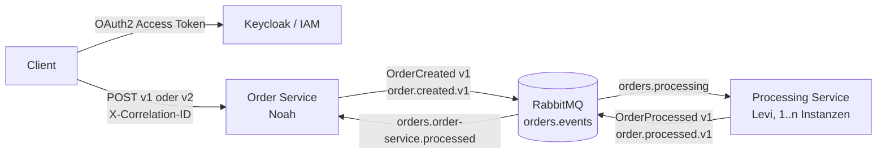

# M321 Order Service

**Owner:** Noah  
**Purpose:** Order Service of the distributed Order Processing System for module M321.

Dieses Repository (`m321-order-service`) enthält ausschliesslich Noahs **Order Service**. Er nimmt Bestellungen per REST an, erzeugt ein `OrderCreated`-Event und delegiert die Verarbeitung asynchron an Levis separat deploybaren Processing Service. Es gibt keinen direkten Datenzugriff zwischen den Services und keinen gemeinsam genutzten Java-Domain-Code.

## Architektur und Verantwortungen



Der Order Service besitzt den REST-Einstieg und publiziert `OrderCreated`. Der Processing Service besitzt die fachliche Verarbeitung, konsumiert `OrderCreated` und publiziert `OrderProcessed`. RabbitMQ puffert Nachrichten, wenn der Processing Service nicht läuft. Mehrere Processing-Instanzen konkurrieren später auf derselben Queue und erhalten dadurch Work-Queue-/Round-Robin-Verteilung.

## REST API

| Methode | Pfad | Rolle | Zweck |
|---|---|---|---|
| `POST` | `/api/v1/orders` | `USER` oder `ADMIN` | stabile v1-Struktur `{product, quantity}` |
| `POST` | `/api/v2/orders` | `USER` oder `ADMIN` | neue inkompatible Struktur `{productCode, amount}` |
| `GET` | `/api/admin` | `ADMIN` | IAM-/Rollen-Demo |
| `GET` | `/` | öffentlich | Weiterleitung zu Swagger UI |
| `GET` | `/swagger-ui/**`, `/v3/api-docs/**` | öffentlich | API-Dokumentation |

Beide Order-Endpunkte antworten sofort mit `202 Accepted`. Sie warten nicht auf Levi. Beispielantwort:

```json
{
  "orderId": "6fe4b9bb-d89d-43c2-af6a-cd6fa4b453ae",
  "correlationId": "demo-correlation-123",
  "status": "ACCEPTED",
  "acceptedAt": "2026-09-18T08:00:00Z"
}
```

Ungültige Eingaben ergeben `400`, ein fehlendes/ungültiges Token `401` und eine fehlende Rolle `403`. Der statische Vertrag liegt in [openapi.yaml](openapi.yaml); die laufende Springdoc-Ausgabe ist unter `/v3/api-docs` verfügbar. REST-DTOs unter `api` sind bewusst von Event-DTOs unter `event` getrennt.

## RabbitMQ-Vertrag

| Typ | Name | Routing Key / Binding | Eigentümer |
|---|---|---|---|
| Topic Exchange | `orders.events` | durable | beide Services dürfen idempotent deklarieren |
| Queue | `orders.processing` | `order.created.v1` | Levi konsumiert; Order Service deklariert sie für Offline-Pufferung |
| Queue | `orders.order-service.processed` | `order.processed.v1` | Noah konsumiert |

### OrderCreated v1

Der Order Service publiziert persistent auf `orders.events` mit `order.created.v1`:

```json
{
  "eventId": "44ca29b2-3c50-4b7c-8fd5-87864916b98a",
  "correlationId": "demo-correlation-123",
  "orderId": "6fe4b9bb-d89d-43c2-af6a-cd6fa4b453ae",
  "product": "Keyboard",
  "quantity": 2,
  "createdAt": "2026-09-18T08:00:00Z",
  "eventVersion": 1
}
```

### OrderProcessed v1

Levi publiziert nach erfolgreicher Verarbeitung auf `orders.events` mit `order.processed.v1`:

```json
{
  "eventId": "0bd7601e-10d7-4fab-b615-f2b12445b676",
  "correlationId": "demo-correlation-123",
  "orderId": "6fe4b9bb-d89d-43c2-af6a-cd6fa4b453ae",
  "processedAt": "2026-09-18T08:00:03Z",
  "status": "PROCESSED",
  "eventVersion": 1
}
```

Der portable Vertrag liegt in [asyncapi.yaml](asyncapi.yaml). Diese Datei kann ohne Java-Code in ein späteres Shared-Contracts-Repository kopiert werden.

## Correlation ID und Observability

Der HTTP-Filter übernimmt einen nicht-leeren Header `X-Correlation-ID`; fehlt er, erzeugt er eine UUID. Die effektive ID steht auch im Response-Header und im `OrderCreated`-Payload. Levi muss sie unverändert in `OrderProcessed` übernehmen. Auf HTTP- und AMQP-Seite wird sie im MDC gesetzt, sodass relevante Logs das Muster `correlationId:<wert>` tragen.

## Idempotenz und Event-Evolution

`OrderProcessed` wird anhand von `eventId` über das Interface `EventIdempotencyStore` dedupliziert. Die aktuelle Implementierung nutzt ein threadsicheres In-Memory-Set. Eine Wiederholung wird als `Duplicate event ignored: ...` geloggt und fachlich nicht erneut verarbeitet.

Grenze dieser Schullösung: Der Speicher geht bei einem Neustart verloren und wird nicht zwischen mehreren Order-Service-Instanzen geteilt. Für Produktion kann dieselbe Schnittstelle durch einen persistenten Store mit Unique Constraint ersetzt werden.

Die Event-DTOs ignorieren unbekannte JSON-Felder (`@JsonIgnoreProperties(ignoreUnknown = true)`). Auch AsyncAPI erlaubt zusätzliche Eigenschaften. Damit bleiben bestehende Consumer bei additiven, optionalen Feldern als Tolerant Reader funktionsfähig. Inkompatible Änderungen erhalten eine neue Event-Version und einen neuen Routing Key.

## IAM, OAuth2, OIDC und JWT

- **IAM** verwaltet Identitäten und Zugriffsrechte.
- **Keycloak** ist der Identity Provider und das IAM-System dieses Projekts.
- **OIDC** ergänzt die Authentifizierung und beschreibt die Identität des Benutzers.
- **OAuth2** autorisiert den API-Zugriff mittels Access Token.
- **JWT** ist das signierte Tokenformat, das der Spring Resource Server validiert.

Spring Security verwendet moderne Resource-Server-Unterstützung, keinen alten Keycloak-Adapter. Signatur, Ablauf und Issuer werden mit Keycloaks JWKs validiert. Realm-Rollen aus `realm_access.roles` werden auf `ROLE_USER` und `ROLE_ADMIN` abgebildet.

Der reproduzierbare Realm-Import [keycloak/m321-realm.json](keycloak/m321-realm.json) enthält:

- Realm `m321`
- Public OIDC Client `m321-order-client`, Authorization Code + PKCE
- Development-only Direct Access Grant für eine kompakte CLI-Demo
- Rollen `USER`, `ADMIN`
- `demo-user` / `user123` mit `USER`
- `demo-admin` / `admin123` mit `ADMIN`

Diese Passwörter sind ausschliesslich lokale Demo-Defaults. Secrets stehen nicht im Java-Code. Issuer, JWK-URL, Client-ID und RabbitMQ-Zugangsdaten sind per Umgebungsvariablen überschreibbar; siehe `application.properties` und `docker-compose.yml`.

## Expand and Contract

Die Breaking-Change-Demo verwendet eine inkompatible Request-Struktur:

```text
v1: { "product": "Keyboard", "quantity": 2 }
v2: { "productCode": "KEYBOARD-01", "amount": 2 }
```

1. v1 existiert und bleibt erreichbar.
2. v2 wird zusätzlich deployt (Expand).
3. Bestehende Clients arbeiten unverändert über v1 weiter.
4. Clients migrieren unabhängig auf v2.
5. v1 würde erst entfernt, wenn alle Clients migriert sind (Contract); für die Demo bleibt es erhalten.

Beide Versionen werden intern auf dieselbe Order-Annahme und denselben `OrderCreated v1`-Vertrag abgebildet. REST- und Event-Versionierung sind voneinander unabhängig.

## Resilienz und Skalierung

Ist Levi aus, bleibt `OrderCreated` in der durable Queue `orders.processing` als persistente Nachricht liegen. Der Order Service antwortet dennoch `202`, solange RabbitMQ erreichbar ist. Nach Levis Start wird die Nachricht nachträglich verarbeitet. Der Order Service führt keinen synchronen HTTP-Aufruf und kein Polling zu Levi aus.

Der Order Service ist bis auf den dokumentierten In-Memory-Idempotenz-Cache stateless. Levis Processing Service kann horizontal skaliert werden: Alle Instanzen konsumieren konkurrierend aus `orders.processing`. Es gibt keine gemeinsame Datenbank und keine Java-Shared-Library.

## Start

Voraussetzungen: Java 17, Docker Desktop und optional ein lokales Maven. Infrastruktur starten:

```powershell
docker compose up -d
docker compose ps
```

Service starten:

```powershell
.\mvnw.cmd spring-boot:run
```

Falls der Wrapper lokal kein Repository anlegen darf, funktioniert äquivalent `mvn spring-boot:run`.

| Komponente | URL |
|---|---|
| Order Service | http://localhost:8081 |
| Swagger UI | http://localhost:8081/swagger-ui.html |
| Keycloak Admin | http://localhost:8080/admin/ (`admin` / `admin`) |
| RabbitMQ UI | http://localhost:15672 (`guest` / `guest`) |

Keycloak importiert den Realm nur, wenn er im persistenten Development-Volume noch nicht existiert. Für einen absichtlichen frischen Import muss das Keycloak-Volume entfernt werden; dabei gehen lokale Keycloak-Daten verloren.

## Tests und Build

```powershell
mvn test
mvn package
```

Die Tests prüfen `401`, die USER-/ADMIN-Regeln, v1, v2, Validierung, Übernahme und Generierung der Correlation ID, Inhalt von `OrderCreated` sowie die Deduplizierung eingehender Events. RabbitMQ und Keycloak werden in diesen Tests nicht benötigt.

## LEVI HANDOFF

Levi benötigt **nur** [asyncapi.yaml](asyncapi.yaml) sowie optional [docker-compose.yml](docker-compose.yml). Nicht teilen: Java-DTOs, Domain-Klassen oder dieses Repository als Dependency.

Processing Service implementieren:

1. RabbitMQ-Verbindung über `RABBITMQ_HOST`, `RABBITMQ_PORT`, `RABBITMQ_USERNAME`, `RABBITMQ_PASSWORD` konfigurierbar machen.
2. Durable Topic Exchange `orders.events` idempotent deklarieren.
3. Durable Queue `orders.processing` deklarieren und mit `order.created.v1` binden.
4. JSON `OrderCreated v1` exakt gemäss AsyncAPI konsumieren. Unbekannte zusätzliche Felder ignorieren.
5. Mehrere Instanzen als konkurrierende Consumer derselben Queue betreiben; keine instanzspezifische Queue erzeugen.
6. `eventId` des eingehenden Events idempotent behandeln. Bei fachlichem Retry dieselbe Nachricht nicht doppelt verarbeiten.
7. `correlationId` und `orderId` unverändert übernehmen und in alle relevanten Logs/MDC setzen.
8. Für jedes Ergebnis eine **neue eindeutige** `eventId` und `processedAt` erzeugen.
9. `OrderProcessed v1` als persistentes JSON auf `orders.events` mit Routing Key `order.processed.v1` publizieren.
10. Mindestens `status: "PROCESSED"` und `eventVersion: 1` liefern.

Wichtig für Java/Spring AMQP: Keine gemeinsame Java-Klasse voraussetzen. JSON-Feldnamen und Typen sind der Vertrag. UUIDs und Zeitpunkte werden als Strings (ISO-8601 für Zeit) serialisiert. Die AMQP-Correlation-ID darf zusätzlich gesetzt werden; massgeblich und verpflichtend ist `correlationId` im Payload.

## Live-Demo passend zum Bewertungsraster

### 1. Infrastruktur und Tokens

```powershell
docker compose up -d
mvn spring-boot:run
```

In einem zweiten Terminal:

```powershell
$userToken = (Invoke-RestMethod -Method Post `
  -Uri "http://localhost:8080/realms/m321/protocol/openid-connect/token" `
  -ContentType "application/x-www-form-urlencoded" `
  -Body @{grant_type="password";client_id="m321-order-client";username="demo-user";password="user123"}).access_token

$adminToken = (Invoke-RestMethod -Method Post `
  -Uri "http://localhost:8080/realms/m321/protocol/openid-connect/token" `
  -ContentType "application/x-www-form-urlencoded" `
  -Body @{grant_type="password";client_id="m321-order-client";username="demo-admin";password="admin123"}).access_token
```

### 2. Security zeigen

Ohne Token `POST /api/v1/orders` aufrufen: `401`. Danach mit USER erfolgreich eine Order erstellen. Mit USER `/api/admin` aufrufen: `403`; mit ADMIN: `200`.

### 3. Resilienz und Correlation ID zeigen

Levis Service bleibt zunächst **aus**. Bestellung erstellen:

```powershell
$headers = @{Authorization="Bearer $userToken";"X-Correlation-ID"="live-demo-321"}
$v1 = @{product="Keyboard";quantity=2} | ConvertTo-Json
Invoke-WebRequest -Method Post -Uri "http://localhost:8081/api/v1/orders" `
  -Headers $headers -ContentType "application/json" -Body $v1
```

Zeigen: `202`, Response-Header/Body enthalten `live-demo-321`, Log enthält dieselbe ID. In RabbitMQ unter `orders.processing` steht eine Nachricht als **Ready**. Nun Levi starten. Zeigen: Ready fällt auf 0, Levi loggt dieselbe Correlation ID, publiziert `OrderProcessed`, und Noah loggt `Order processed` ebenfalls mit `live-demo-321`.

### 4. Idempotenz zeigen

Dasselbe `OrderProcessed`-JSON mit identischer `eventId` zweimal über RabbitMQ publizieren. Beim zweiten Empfang zeigt Noah `Duplicate event ignored`. Für ein neues fachliches Ergebnis muss Levi eine neue `eventId` verwenden.

### 5. Breaking Change ohne gemeinsames Deployment zeigen

Zuerst v1 wie oben aufrufen. Danach ohne Änderung oder Abschaltung von v1 auch v2 aufrufen:

```powershell
$v2 = @{productCode="KEYBOARD-01";amount=2} | ConvertTo-Json
Invoke-WebRequest -Method Post -Uri "http://localhost:8081/api/v2/orders" `
  -Headers $headers -ContentType "application/json" -Body $v2
```

Beide liefern `202`. In Swagger/OpenAPI die inkompatiblen Request-Schemas und die parallele Verfügbarkeit zeigen; in AsyncAPI den stabilen Eventvertrag zeigen.

### 6. Skalierung zeigen

Levis Processing Service zweimal starten. Mehrere Orders senden und anhand seiner Instanz-/Worker-Logs zeigen, dass RabbitMQ die Nachrichten über konkurrierende Consumer verteilt. Noahs Service bleibt unverändert.
